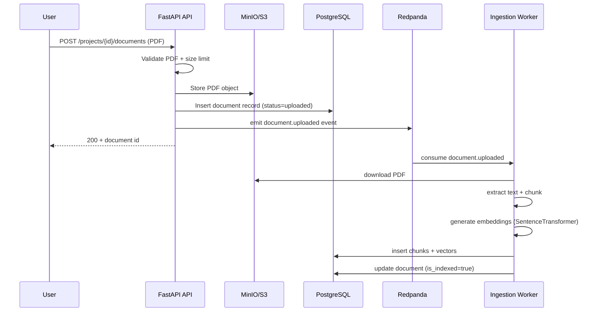
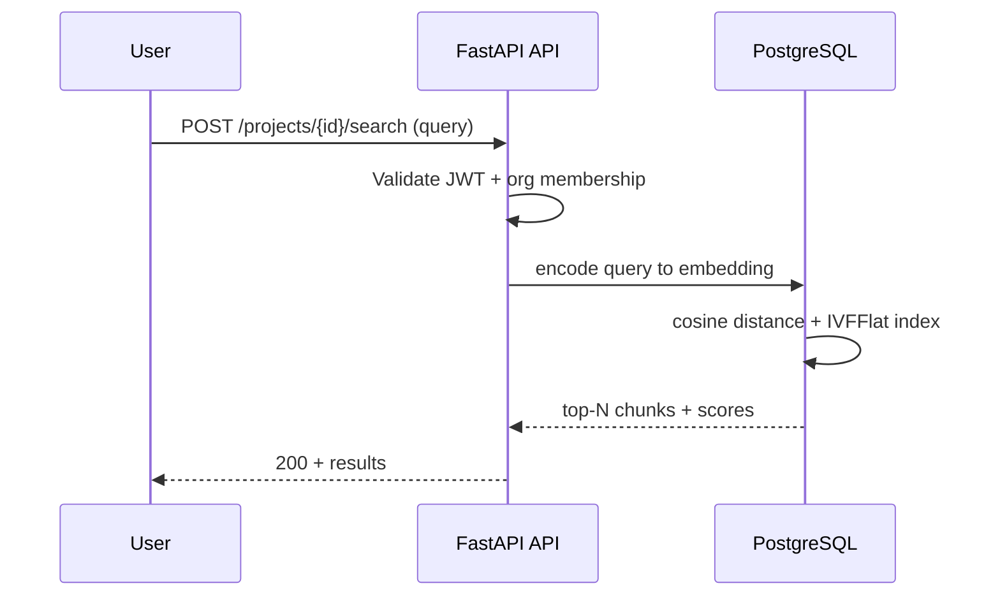
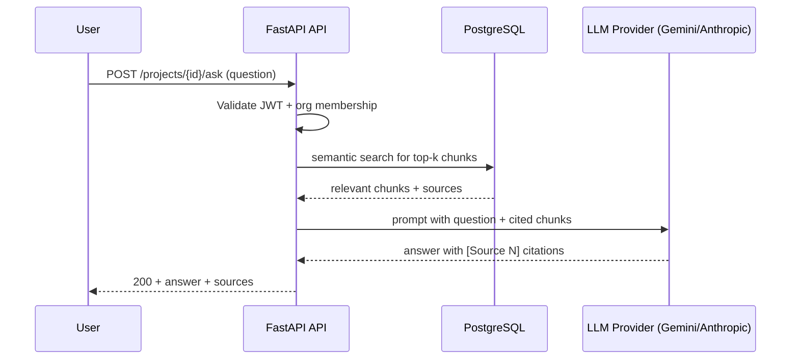

# AtlasOps Data Flow Diagrams

## Upload Path

```mermaid
sequenceDiagram
    participant U as User
    participant API as FastAPI API
    participant MinIO as MinIO/S3
    participant DB as PostgreSQL
    participant RP as Redpanda
    participant W as Ingestion Worker

    U->>API: POST /projects/{id}/documents (PDF)
    API->>API: Validate PDF + size limit
    API->>MinIO: Store PDF object
    API->>DB: Insert document record (status=uploaded)
    API->>RP: emit document.uploaded event
    API-->>U: 200 + document id

    RP->>W: consume document.uploaded
    W->>MinIO: download PDF
    W->>W: extract text + chunk
    W->>W: generate embeddings (SentenceTransformer)
    W->>DB: insert chunks + vectors
    W->>DB: update document (is_indexed=true)
```

## Query Path (Semantic Search)

```mermaid
sequenceDiagram
    participant U as User
    participant API as FastAPI API
    participant DB as PostgreSQL

    U->>API: POST /projects/{id}/search (query)
    API->>API: Validate JWT + org membership
    API->>DB: encode query to embedding
    DB->>DB: cosine distance + IVFFlat index
    DB-->>API: top-N chunks + scores
    API-->>U: 200 + results
```

## Query Path (Ask / LLM Q&A)

```mermaid
sequenceDiagram
    participant U as User
    participant API as FastAPI API
    participant DB as PostgreSQL
    participant LLM as LLM Provider (Gemini/Anthropic)

    U->>API: POST /projects/{id}/ask (question)
    API->>API: Validate JWT + org membership
    API->>DB: semantic search for top-k chunks
    DB-->>API: relevant chunks + sources
    API->>LLM: prompt with question + cited chunks
    LLM-->>API: answer with [Source N] citations
    API-->>U: 200 + answer + sources
```
